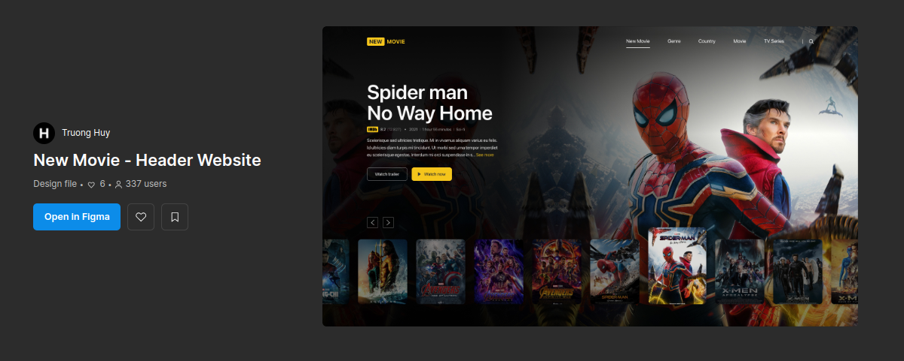

<h1>Estudando TailwindCSS</h1>

Peguei um projeto do figma e comecei a programar em ReactJS, com TailwindCSS para eu me aprofundar mais nessa ferramenta.

## Preview

    
  

### Preview do Projeto no Figma

    
  

### 👨‍💻 Tecnologias

Esse projeto foi desenvolvido com as seguintes tecnologias:

- ReactJS
- TailwindCSS
- Figma
- Vite

    by Yago.

